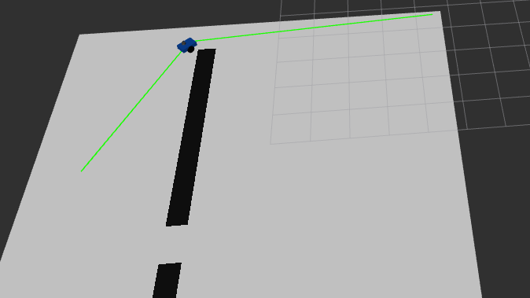

# MotionLab ROS 2 Navigation

基于 ROS 2 Jazzy 的差速移动机器人规划与控制项目。

项目从底层实现了完整的移动机器人导航链路，包括 A* 全局路径规划、路径后处理、Pure Pursuit 路径跟踪、LiDAR 安全停车、Gazebo / RViz 仿真验证，并加入 GoogleTest 单元测试与 GitHub Actions CI。

---

## Demo

**A* Global Planning + Pure Pursuit Tracking**

RViz 中可同时观察栅格地图、规划路径、机器人位姿及路径跟踪过程。机器人根据 A* 生成的全局路径运动，并由 Pure Pursuit 完成闭环路径跟踪。

---

## 1. Project Overview

主要功能：

- 差速移动机器人 URDF / Xacro 建模
- Gazebo Sim 仿真
- Differential Drive 驱动
- 里程计 `/odom`
- TF 坐标变换
- 激光雷达 `/scan`
- C++ A* 全局路径规划
- A* 路径简化与加密
- C++ Pure Pursuit 路径跟踪
- LiDAR 障碍物安全停车
- 安全停车滞回机制
- RMSE / 最大跟踪误差统计
- GoogleTest A* 单元测试
- GitHub Actions ROS 2 CI

---

## 2. System Architecture

~~~text
AStarCore
   │
   ▼
AStar Planner
   │
   ├── /grid_map ───────────────> RViz
   │
   └── /planned_path
             │
             ▼
      Pure Pursuit Controller
       ▲                 │
       │ /odom           │ /cmd_vel_raw
       │                 ▼
       │          LiDAR Safety Stop
       │              ▲       │
       │        /scan │       │ /cmd_vel
       │              │       ▼
       └──────── Gazebo Differential Drive
                          │
                     ┌────┴────┐
                     ▼         ▼
                   /odom     /scan
~~~

控制链路：

~~~text
A* Planner
    ↓
/planned_path
    ↓
Pure Pursuit
    ↓
/cmd_vel_raw
    ↓
LiDAR Safety Stop
    ↓
/cmd_vel
    ↓
Gazebo Robot
~~~

`navigation_demo.launch.py` 可一键启动仿真、规划器、控制器、安全节点和 RViz。

---

## 3. ROS 2 Nodes and Topics

| 节点 | 订阅 | 发布 | 功能 |
|---|---|---|---|
| `astar_planner` | — | `/grid_map`, `/planned_path` | A* 全局路径规划 |
| `pure_pursuit_controller` | `/planned_path`, `/odom` | `/cmd_vel_raw` | Pure Pursuit 路径跟踪 |
| `lidar_safety_stop` | `/cmd_vel_raw`, `/scan` | `/cmd_vel` | 障碍检测与安全速度仲裁 |
| Gazebo Differential Drive | `/cmd_vel` | `/odom` | 执行机器人运动并发布里程计 |
| Gazebo LiDAR | — | `/scan` | 发布激光雷达数据 |
| RViz2 | Map / Path / TF | — | 导航过程可视化 |

---

## 4. A* Global Path Planning

### 4.1 A* Search

A* 使用评价函数：

~~~text
f(n) = g(n) + h(n)
~~~

其中：

- `g(n)`：从起点到当前节点的累计实际代价
- `h(n)`：当前节点到目标点的启发式估计
- `f(n)`：节点的综合搜索代价

规划器采用 8 邻域栅格搜索。

水平和垂直移动代价为一个栅格距离，对角移动代价按照欧氏距离计算。

---

### 4.2 Corner-Cutting Prevention

规划器实现了对角穿角保护。

例如：

~~~text
S █
█ G
~~~

虽然起点 `S` 与目标 `G` 在几何上对角相邻，但两个相邻方向均存在障碍物，因此禁止直接对角穿越。

这样可以避免 A* 在离散栅格环境中产生不合理的“穿墙角”路径。

---

### 4.3 Path Processing

原始 A* 路径经过进一步处理：

~~~text
Raw A* Path
     ↓
Path Simplification
     ↓
Path Densification
     ↓
/planned_path
~~~

路径简化减少冗余节点。

路径加密在相邻关键路径点之间插入更密集的参考点，为 Pure Pursuit 提供更加连续的参考轨迹。

---

### 4.4 AStarCore

A* 核心搜索算法已经从 ROS 2 节点中解耦为独立的：

~~~text
AStarCore
~~~

当前结构：

~~~text
                  AStarCore
                 /         \
                /           \
       AStar Planner      GoogleTest
          ROS Node        Unit Tests
~~~

`AStarCore` 负责：

- 栅格搜索
- 开放集合与关闭集合管理
- g cost
- heuristic
- parent 回溯
- 对角穿角保护

`astar_planner` ROS 2 节点负责：

- ROS 参数读取
- 地图构造
- 坐标转换
- 路径后处理
- `/grid_map` 发布
- `/planned_path` 发布

这样核心算法可以脱离 Gazebo 和 ROS 通信环境单独测试。

---

### 4.5 Demo Planning Parameters

导航 Demo 使用：

| 参数 | 数值 |
|---|---:|
| Start | `(0.5, 0.5)` |
| Goal | `(9.5, 5.5)` |
| Grid Resolution | `0.5 m` |

AStarPlanner 源码自身具有默认参数，但 `navigation_demo.launch.py` 会覆盖 Demo 起点。

---

## 5. Pure Pursuit Path Tracking

Pure Pursuit 控制器根据 `/odom` 获取机器人实时位姿，并在 `/planned_path` 中寻找前视目标点。

控制流程：

~~~text
Robot Pose
    ↓
Nearest Path Point
    ↓
Lookahead Point
    ↓
Target Geometry
    ↓
Curvature
    ↓
Linear Velocity
Angular Velocity
~~~

前视距离 `lookahead_distance` 会影响跟踪精度与轨迹平滑性：

- 较小前视距离：响应灵敏，但转向变化更加频繁
- 较大前视距离：运动更加平滑，但弯道跟踪误差可能增大

---

### Demo Parameters

| 参数 | Demo 值 |
|---|---:|
| `lookahead_distance` | 默认 `0.6 m` |
| `nominal_speed` | `0.25 m/s` |
| `max_angular_speed` | `1.0 rad/s` |
| `goal_tolerance` | `0.15 m` |

---

### Tracking Metrics

控制器在导航完成后自动输出：

- RMSE
- Maximum Tracking Error
- Samples
- Final Goal Distance

一次导航运行示例：

~~~text
Path completed: distance=0.146
Tracking metrics: RMSE=0.162, max_error=0.707, samples=1153
~~~

这些指标可用于比较不同 Pure Pursuit 参数下的路径跟踪性能。

---

## 6. LiDAR Safety Control

Pure Pursuit 输出的速度不会直接发送给机器人。

速度首先经过独立安全节点：

~~~text
Pure Pursuit
     ↓
/cmd_vel_raw
     ↓
LiDAR Safety Stop
     ↓
/cmd_vel
     ↓
Gazebo Robot
~~~

安全节点检查机器人前方约 30° 范围内的激光雷达距离。

参数：

| 参数 | 数值 |
|---|---:|
| `stop_distance` | `0.6 m` |
| `release_margin` | `0.1 m` |
| `front_angle_deg` | `30°` |

---

### Hysteresis

为了避免障碍物距离在阈值附近波动导致机器人频繁停车和恢复，安全节点加入滞回机制。

停车条件：

~~~text
distance < 0.6 m
        ↓
       STOP
~~~

恢复条件：

~~~text
distance > 0.7 m
        ↓
      RELEASE
~~~

因此：

~~~text
0.6 m                 0.7 m
  │                      │
  ▼                      ▼
STOP ───── Hysteresis ─── RELEASE
~~~

0.6 m 到 0.7 m 之间形成滞回区域，可以减少控制状态频繁切换。

---

## 7. Unit Testing

项目使用 `ament_cmake_gtest` 对 `AStarCore` 进行 C++ 单元测试。

当前包含四个核心测试：

~~~text
AStarCoreTest.FindsPathOnEmptyGrid

AStarCoreTest.FindsPathThroughWallGap

AStarCoreTest.ReturnsEmptyWhenNoPathExists

AStarCoreTest.DoesNotCutDiagonalCorner
~~~

分别验证：

1. 空地图能够找到路径
2. 障碍墙存在缺口时能够正确通过
3. 起点与目标完全隔离时能够正确返回无路径
4. A* 不会通过两个障碍物之间的对角墙角

---

### Regression Test Verification

开发过程中曾故意关闭对角穿角保护。

结果：

~~~text
Correct A*
    ↓
4 Tests Passed

Disable Corner Protection
    ↓
DoesNotCutDiagonalCorner FAILED

Restore A*
    ↓
4 Tests Passed
~~~

这证明单元测试能够在核心算法出现回归错误时及时报警。

本地测试：

~~~bash
colcon test --packages-select motionlab_control_cpp
colcon test-result --verbose
~~~

---

## 8. GitHub Actions CI

项目使用 GitHub Actions 建立 ROS 2 持续集成流程。

触发条件：

~~~text
Pull Request → main

或

Push → main
~~~

CI 会在独立的 Ubuntu / ROS 2 Jazzy 环境中自动完成：

~~~text
Source Code
    ↓
ROS 2 Jazzy Environment
    ↓
colcon build
    ↓
colcon test
    ↓
GoogleTest
cppcheck
uncrustify
lint_cmake
xmllint
    ↓
PASS / FAIL
~~~

因此代码进入 `main` 前需要同时通过：

- ROS 2 编译
- C++ 单元测试
- 静态检查
- C++ 格式检查
- CMake 检查
- XML 检查

---

## 9. Build

开发环境：

- Windows + WSL2
- Ubuntu 24.04
- ROS 2 Jazzy
- C++
- Python
- Gazebo Sim
- RViz2

构建：

~~~bash
cd ~/motionlab_ws

colcon build --symlink-install

source install/setup.bash
~~~

---

## 10. Run Navigation Demo

启动完整导航：

~~~bash
ros2 launch motionlab_simulation navigation_demo.launch.py
~~~

修改 Pure Pursuit 前视距离：

~~~bash
ros2 launch motionlab_simulation navigation_demo.launch.py lookahead_distance:=0.6
~~~

Demo 会启动：

- Gazebo Sim
- Robot Description
- A* Planner
- Pure Pursuit Controller
- LiDAR Safety Stop
- RViz2

---

## 11. Project Structure

~~~text
motionlab_ws/
├── .github/
│   └── workflows/
│       └── ros2-ci.yml
│
├── src/
│   ├── motionlab_control_cpp/
│   │   ├── include/
│   │   │   └── motionlab_control_cpp/
│   │   │       └── astar_core.hpp
│   │   │
│   │   ├── src/
│   │   │   ├── astar_core.cpp
│   │   │   ├── astar_planner.cpp
│   │   │   ├── pure_pursuit_controller.cpp
│   │   │   └── lidar_safety_stop.cpp
│   │   │
│   │   └── test/
│   │       └── test_astar_core.cpp
│   │
│   ├── motionlab_robot_description/
│   └── motionlab_simulation/
│
└── README.md
~~~

---

## 12. WSL2 Notes

Gazebo 和 RViz 同时运行时可能产生较高 CPU / GPU 负载。

如果 RViz 出现 WSLg、OpenGL 或 GLSL 卡顿，可以尝试软件渲染：

~~~bash
LIBGL_ALWAYS_SOFTWARE=1 rviz2
~~~

同时应避免重复启动多个 Gazebo 或 RViz 实例。

---

## 13. Current Status

已完成：

- [x] ROS 2 差速机器人模型
- [x] Gazebo 仿真
- [x] 激光雷达与 Odometry
- [x] A* 全局路径规划
- [x] 8 邻域搜索
- [x] Corner-cutting prevention
- [x] 路径简化
- [x] 路径加密
- [x] Pure Pursuit 路径跟踪
- [x] Pure Pursuit 参数实验
- [x] RMSE / 最大跟踪误差统计
- [x] LiDAR 安全停车
- [x] Hysteresis
- [x] AStarCore 算法解耦
- [x] GoogleTest 单元测试
- [x] GitHub Actions CI
- [x] Gazebo / RViz 集成验证

下一步：

- [ ] 整理 Pure Pursuit 参数实验对比图
- [ ] 增加 Demo 截图
- [ ] 增加 Demo GIF / Video
- [ ] 增加 rosbag 自动实验记录
- [ ] 整理简历项目描述和面试讲稿
